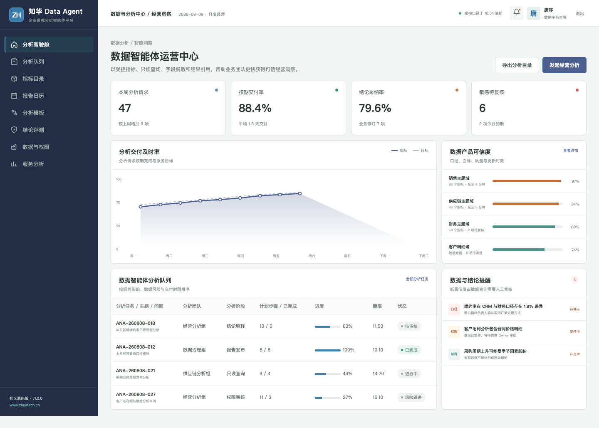
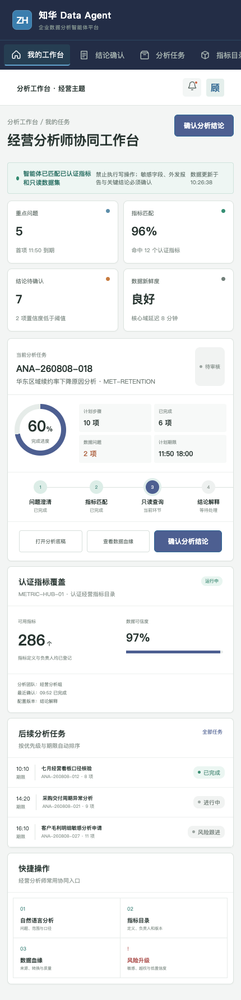

# DataAgent · 知华科技数据分析智能体

> 先确认指标口径，再让数据回答业务问题。
>
> [知华科技（上海如静知华信息科技有限公司）官网](https://www.zhuatech.cn/) · 企业 AI 转型、Agent 定制、私有化部署与软件项目外包

面向经营分析师、数据治理和业务团队的可信数据 Agent 社区源码项目。系统提供指标检索、只读查询、数据血缘、结论解释、敏感信息控制和人工发布流程。

## 可信分析约定

- 不绕过现有数据权限，不在演示模式连接生产库。
- 优先使用已认证指标，并展示定义、版本和负责人。
- 默认只读，限制结果规模，敏感字段进入脱敏或审批流程。
- 区分相关性与因果结论，明确数据范围和限制条件。
- 关键经营结论由分析师确认后才能发布或外发。

## 产品界面

数据智能体运营中心提供跨团队任务、风险、建议评测和数据工具的运营视角。

经营分析师协同工作台面向一线业务角色，保留证据、建议、人工确认和结果回写的完整链路。

## 主要能力

- 自然语言问题澄清与分析计划
- 认证指标检索与口径引用
- 只读 SQL 策略和行数限制
- 行列权限与敏感字段脱敏提示
- 数据血缘、质量和新鲜度说明
- 关键经营结论与外发报告人工确认

## 工程实现

| 层次 | 技术与职责 |
| --- | --- |
| H5 / Web | Vue 3、Pinia、Vue Router、Axios、Vite，响应式适配桌面与移动端 |
| Java API | Java 21、Spring Boot、Spring Security、JWT、JPA、Bean Validation |
| Agent 边界 | AgentRuntime 可替换，默认只运行本地演示，不调用真实模型或业务系统 |
| 领域策略 | QueryGuardService 提供可测试、可解释的业务安全规则 |
| 数据 | MySQL 8、Flyway；测试环境使用 H2 |
| 交付 | Docker Compose、Nginx、CI、API、架构、数据库和部署文档 |

拦截写操作和未授权敏感查询，将结果限制在 1000 行以内，并记录指标口径、SQL 指纹与数据权限控制。

## 本地体验

仅查看演示界面：

~~~bash
cd frontend
npm install
npm run dev:demo
~~~

访问 http://localhost:5173。管理端使用 **planner / Demo@2026**，业务协同端使用 **operator / Demo@2026**。

完整部署参数见 [deploy/README.md](deploy/README.md)，接口见 [docs/api.md](docs/api.md)，架构边界见 [docs/architecture.md](docs/architecture.md)。

## 使用许可与商业授权

本工程采用知华科技社区源码许可，**仅限个人学习、研究和非商业技术交流，不得商用**。企业内部使用、生产部署、项目交付、SaaS、收费服务、二次销售、品牌替换或其他商业用途，必须事先取得上海如静知华信息科技有限公司书面授权。完整条款以 [LICENSE](LICENSE) 为准。

深度定制、私有化部署、商业授权、AI Agent 咨询和软件项目外包，可访问[知华科技官网](https://www.zhuatech.cn/)或扫码咨询。

| 商务与技术咨询 | 项目合作咨询 |
| --- | --- |
|  |  |

SEO 关键词：Data Agent,数据分析智能体,Text to SQL,经营分析 AI,指标平台 Agent,Java Vue 数据系统，知华科技，上海如静知华信息科技有限公司。

